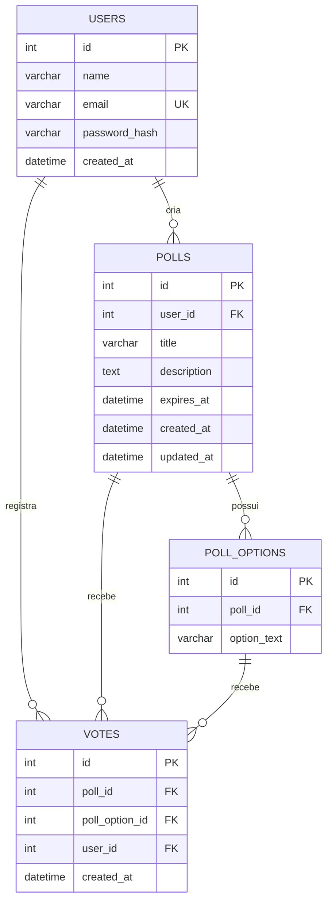

## Sistema de Enquetes

Aplicação web para criação de enquetes com votação e resultados em tempo
real. Desafio técnico trainee/júnior: front e back separados, autenticação,
CRUD de enquetes e atualização automática dos votos.

## Estrutura

enquetes/
├── backend/     # API PHP
└── frontend/    # SPA React + Vite

## Como rodar a aplicação

Backend:

bash
cd backend
`cp .env.example .env`      # ajuste usuário/senha do MySQL
`mysql -u root -p < database/schema.sql`
`php -S localhost:8000 -t public`

Frontend (em outro terminal):

bash
cd frontend
``cp .env.example .env``
``npm install``
``npm run dev``

Abra http://localhost:5173.

## Funcionalidades

Cadastro, login e proteção de rotas (JWT)
Criar, listar e excluir enquetes (só o criador exclui)
Votação com regra de um voto por usuário (validada na aplicação e no banco)
Resultados atualizando automaticamente, sem refresh
Enquetes com data de expiração opcional

## Diagrama do banco de dados

## Decisões técnicas

Backend em PHP puro, sem framework: 
Mais simples de acompanhar linha a linha, já que era minha primeira vez trabalhando com PHP.
JWT em vez de sessão: front e back rodam em portas/origens diferentes (Vite em 5173, PHP em 8000), o que complica cookies de sessão entre domínios.
Token no header resolve isso sem CORS extra.

Tempo real via polling (GET /polls/{id}/results a cada poucos segundos):
Cheguei a implementar com Server-Sent Events, mas o servidor embutido do PHP (php -S) no Windows não roda múltiplas requisições em
paralelo, e a conexão SSE (de longa duração) travava o restante da API enquanto ficava aberta.
Polling resolve porque cada chamada é curta e libera o servidor na hora.
Em produção, com PHP-FPM/Nginx, SSE voltaria a ser uma opção viável.
Regra de "um voto por usuário": validada tanto no código quanto por uma constraint UNIQUE no banco, pra cobrir o caso de dois votos simultâneos.

## Documentação da API

Rotas detalhadas em backend/README.md. 
Collection do Postman em backend/postman_collection.json.